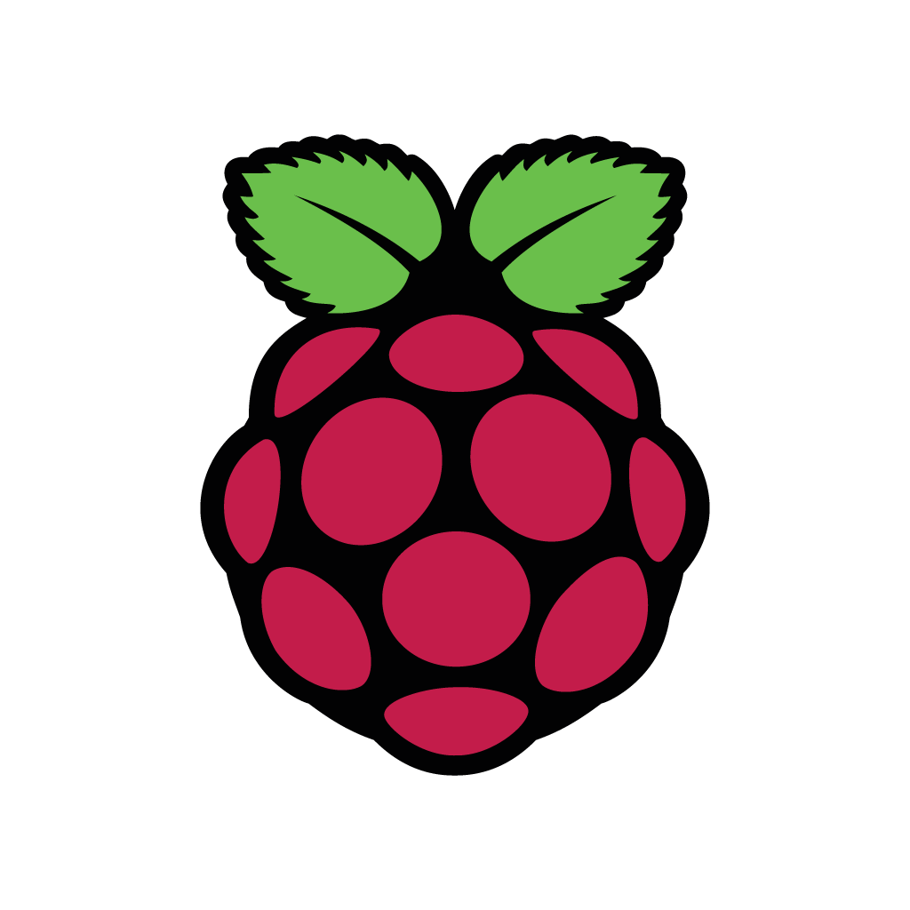

# AwakeCam Component Reference Guide

## Table of Contents
1. [Backend Components](#backend-components)
2. [Frontend Components](#frontend-components)
3. [AI/ML Components](#aiml-components)
4. [Hardware Integration](#hardware-integration)
5. [Styling Components](#styling-components)

---

## Backend Components

### Flask Application (`awakecam.py`)

#### Application Initialization
```python
app = Flask(__name__)
```
- **Purpose**: Creates the main Flask web application instance
- **Configuration**: Default Flask settings with template and static file handling
- **Port**: 5000 (configurable)
- **Host**: 0.0.0.0 (accessible from network)

#### Camera Integration
```python
picam2 = Picamera2()
preview_config = picam2.create_preview_configuration(main={"size": (600, 400), "format": 'RGB888'})
picam2.configure(preview_config)
picam2.start()
```

**Configuration Details**:
- **Resolution**: 600x400 pixels (optimized for real-time processing)
- **Format**: RGB888 (24-bit color depth)
- **Frame Rate**: Automatic (typically 30 FPS)
- **Buffer**: Single frame buffer for low latency

**Camera Methods**:
- `picam2.capture_array()`: Captures single frame as numpy array
- `picam2.start()`: Begins camera streaming
- `picam2.stop()`: Stops camera streaming (not used in current implementation)

#### Network Tunneling
```python
def start_ngrok():
    subprocess.Popen(["ngrok", "http", "5000"], stdout=subprocess.DEVNULL, stderr=subprocess.STDOUT)
    time.sleep(2)
```

**Features**:
- **Protocol**: HTTP tunneling over HTTPS
- **Port Forwarding**: Local port 5000 to public URL
- **Process Management**: Runs as background subprocess
- **Error Handling**: Silent failure with localhost fallback

#### Audio System
```python
pygame.mixer.init()
drowsy_sound = pygame.mixer.Sound("drowsiness-detected.mpeg")
sleep_sound = pygame.mixer.Sound("sleep-detected.mpeg")
```

**Audio Configuration**:
- **Library**: pygame.mixer for cross-platform audio
- **Format**: MPEG audio files
- **Playback**: Non-blocking sound playback
- **Volume**: System default (adjustable via pygame.mixer.Sound.set_volume())

**Alert Logic**:
- **Throttling**: 3-second minimum interval between alerts
- **State Tracking**: Separate timers for drowsy and sleep alerts
- **Concurrent Alerts**: Can play both alert types simultaneously

---

## Frontend Components

### HTML Structure

#### Base Template Structure
All HTML pages follow this consistent structure:

```html
<!DOCTYPE html>
<html lang="en">
<head>
    <meta charset="UTF-8">
    <meta name="viewport" content="width=device-width, initial-scale=1.0">
    <title>AwakeCam</title>
    <!-- CSS Dependencies -->
    <link href="https://cdn.jsdelivr.net/npm/bootstrap@5.3.5/dist/css/bootstrap.min.css" rel="stylesheet">
    <link rel="stylesheet" href="[page-specific].css">
    <link rel="stylesheet" href="dashboard.css">
    <link rel="stylesheet" href="help.css">
</head>
<body>
    <!-- Navigation Dashboard -->
    <section class="dashboard">...</section>
    
    <!-- Page Content -->
    <section class="main">...</section>
    
    <!-- Help Icon -->
    <div class="help-icon">?</div>
</body>
</html>
```

#### Navigation Dashboard Component
**File**: Embedded in all HTML files
**Classes**: `dashboard`, `bg-light`, `position-sticky`, `top-0`, `w-100`

**Responsive Breakpoints**:
- `col-lg-*`: Large screens (≥992px)
- `col-md-*`: Medium screens (≥768px)
- `col-sm-*`: Small screens (≥576px)
- `col-*`: Extra small screens (<576px)

**Navigation Elements**:
```html
<div class="col-lg-1" id="logo" onclick="location.href='intro.html'">
    
</div>
<div class="col-lg-8" id="title" onclick="location.href='intro.html'">
    Awake Cam™
</div>
<div class="col-lg-1" id="contact" onclick="location.href='contact.html'">Contact</div>
<div class="col-lg-1" id="login" onclick="location.href='Login_page.html'">Log in</div>
<div class="col-lg-1" id="register" onclick="location.href='register.html'">Sign in</div>
```

### Page-Specific Components

#### Landing Page (`intro.html`)
**Key Components**:
- Hero section with brand messaging
- Bootstrap carousel with product images
- Call-to-action buttons

**Carousel Configuration**:
```html
<div id="myCarousel" class="carousel slide" data-bs-ride="carousel">
    <div class="carousel-inner">
        <div class="carousel-item active bg-slide" style="background-image: url('camera.jpg');"></div>
        <div class="carousel-item bg-slide" style="background-image: url('chip.jpg');"></div>
        <div class="carousel-item bg-slide" style="background-image: url('circuit.jpg');"></div>
    </div>
</div>
```

#### Registration Page (`register.html`)
**Form Structure**:
```html
<form action="/register" method="POST" onsubmit="return rregistered(event)">
    <input type="text" id="username" name="username" class="form-control" required>
    <input type="text" id="first_name" name="first_name" class="form-control" required>
    <input type="text" id="last_name" name="last_name" class="form-control" required>
    <input type="email" id="email" name="email" class="form-control" required>
    <input type="password" id="password" name="password" class="form-control" required>
    <input type="password" id="confirm_password" name="confirm_password" class="form-control" required>
</form>
```

**Validation Features**:
- HTML5 form validation attributes
- Custom JavaScript validation via `rregistered()`
- Password visibility toggle functionality
- Bootstrap form styling classes

#### Main Dashboard (`main.html`)
**Video Stream Component**:
```html

```

**Location Component**:
```html
<section class="map-section text-center">
    <h3>Driver's Location:</h3>
    <div id="map"></div>
    <p id="location-info"></p>
    <script async defer src="https://maps.googleapis.com/maps/api/js?key=YOUR_API_KEY&callback=initMap"></script>
</section>
```

---

## AI/ML Components

### Face Detection System
**Library**: OpenCV (cv2)
**Model**: Haar Cascade Classifier

```python
face_cascade = cv2.CascadeClassifier(cv2.data.haarcascades + 'haarcascade_frontalface_default.xml')
faces = face_cascade.detectMultiScale(gray, scaleFactor=1.1, minNeighbors=5)
```

**Parameters**:
- `scaleFactor=1.1`: Image pyramid scaling factor (10% size reduction per level)
- `minNeighbors=5`: Minimum neighbor rectangles required for detection
- `minSize`: Default (not specified) - minimum face size
- `maxSize`: Default (not specified) - maximum face size

**Input Requirements**:
- Grayscale image (8-bit single channel)
- Adequate lighting conditions
- Face size between ~24x24 and image dimensions

**Output Format**:
```python
# faces is a numpy array of rectangles
# Each rectangle: [x, y, width, height]
for (x, y, w, h) in faces:
    # x, y: top-left corner coordinates
    # w, h: rectangle width and height
```

### Drowsiness Classification System
**Library**: Ultralytics YOLO
**Model**: Custom trained model (`best.pt`)

```python
race_classifier = YOLO('best.pt')
class_names = ['Normal', 'Drowsy', 'Sleep']
```

**Model Specifications**:
- **Input Size**: 224x224 pixels (RGB)
- **Output Classes**: 3 classes (Normal, Drowsy, Sleep)
- **Confidence Threshold**: Dynamic (uses top1 prediction)
- **Processing Time**: ~50-100ms per frame on Raspberry Pi 4

**Inference Pipeline**:
```python
# 1. Extract face region of interest
roi = frame_bgr[y:y+h, x:x+w]

# 2. Resize to model input size
resized = cv2.resize(roi, (224, 224))

# 3. Convert BGR to RGB for YOLO
rgb = cv2.cvtColor(resized, cv2.COLOR_BGR2RGB)

# 4. Run inference
res = race_classifier(rgb)

# 5. Extract results
idx = res[0].probs.top1
conf = res[0].probs.top1conf.item()
label = class_names[idx] if idx < len(class_names) else 'Unknown'
```

**Result Structure**:
- `res[0].probs.top1`: Index of highest confidence class
- `res[0].probs.top1conf`: Confidence score (0.0 to 1.0)
- `res[0].probs.data`: Full probability distribution

### Image Processing Pipeline

#### Frame Conversion
```python
# 1. Capture from Picamera2 (RGB format)
frame = picam2.capture_array()

# 2. Convert to BGR for OpenCV processing
frame_bgr = cv2.cvtColor(frame, cv2.COLOR_RGB2BGR)

# 3. Convert to grayscale for face detection
gray = cv2.cvtColor(frame_bgr, cv2.COLOR_BGR2GRAY)
```

#### Annotation System
```python
# Draw bounding box around detected face
cv2.rectangle(frame_bgr, (x, y), (x+w, y+h), (0, 255, 0), 2)

# Add classification label and confidence
cv2.putText(frame_bgr, f"{label}:{conf:.2f}", (x, y-10), 
           cv2.FONT_HERSHEY_SIMPLEX, 0.7, (0, 255, 255), 2)
```

**Annotation Parameters**:
- **Rectangle Color**: (0, 255, 0) - Green in BGR format
- **Rectangle Thickness**: 2 pixels
- **Text Font**: FONT_HERSHEY_SIMPLEX
- **Text Scale**: 0.7
- **Text Color**: (0, 255, 255) - Yellow in BGR format
- **Text Thickness**: 2 pixels

---

## Hardware Integration

### Raspberry Pi Camera Module
**Supported Models**:
- Raspberry Pi Camera Module v1 (5MP)
- Raspberry Pi Camera Module v2 (8MP)
- Raspberry Pi Camera Module v3 (12MP)
- Raspberry Pi HQ Camera Module

**Connection**:
- **Interface**: CSI (Camera Serial Interface)
- **Connector**: 15-pin ribbon cable
- **Power**: Supplied via CSI connector
- **Enable**: `sudo raspi-config` → Interface Options → Camera

**Performance Characteristics**:
- **Max Resolution**: Depends on module (up to 4056×3040 for v3)
- **Max Frame Rate**: Up to 90fps at lower resolutions
- **Latency**: ~100-200ms total system latency
- **Power Consumption**: ~250mA at 3.3V

### Audio Output System
**Supported Outputs**:
- 3.5mm analog jack
- HDMI audio
- USB audio devices
- I2S DAC modules

**Configuration**:
```bash
# Check available audio devices
aplay -l

# Set default audio output
sudo raspi-config → Advanced Options → Audio
```

**pygame.mixer Configuration**:
```python
# Initialize with default settings
pygame.mixer.init()

# Custom initialization (optional)
pygame.mixer.init(frequency=22050, size=-16, channels=2, buffer=512)
```

### Network Configuration
**Ethernet**: Gigabit Ethernet (Pi 4) or 100Mbps (Pi 3)
**WiFi**: 802.11ac dual-band (Pi 4) or 802.11n (Pi 3)
**Bandwidth Requirements**:
- Local streaming: ~1-5 Mbps
- Remote streaming via ngrok: ~2-10 Mbps depending on quality

---

## Styling Components

### CSS Architecture
The project uses a modular CSS approach with Bootstrap 5.3.5 as the base framework.

#### Global Styles (`dashboard.css`)
**Navigation Styling**:
```css
.dashboard {
    background-color: #f8f9fa !important;
    position: sticky !important;
    top: 0 !important;
    width: 100% !important;
    z-index: 1030;
}

#logo, #title, #contact, #login, #register {
    cursor: pointer;
    padding: 10px;
    text-align: center;
}
```

#### Page-Specific Styles

**Registration Form (`register.css`)**:
```css
.register-form {
    max-width: 400px;
    margin: 50px auto;
    padding: 20px;
    border: 1px solid #ddd;
    border-radius: 10px;
    background-color: #f9f9f9;
}

.form-control {
    margin-bottom: 15px;
}
```

**Landing Page (`intro.css`)**:
```css
.main-page {
    min-height: 100vh;
}

.carousel-item {
    height: 400px;
    background-size: cover;
    background-position: center;
}

.bg-slide {
    position: relative;
}
```

**Help System (`help.css`)**:
```css
.help-icon {
    position: fixed;
    bottom: 20px;
    right: 20px;
    width: 50px;
    height: 50px;
    background-color: #007bff;
    color: white;
    border-radius: 50%;
    display: flex;
    align-items: center;
    justify-content: center;
    cursor: pointer;
    font-size: 20px;
    font-weight: bold;
    z-index: 1000;
}
```

### Responsive Design
**Breakpoint Strategy**:
- **xs** (<576px): Mobile phones (portrait)
- **sm** (≥576px): Mobile phones (landscape)
- **md** (≥768px): Tablets
- **lg** (≥992px): Desktops
- **xl** (≥1200px): Large desktops

**Grid System Usage**:
```html
<!-- Responsive navigation -->
<div class="col-lg-1 col-md-3 col-sm-2 col-2" id="logo">
<div class="col-lg-8 col-md-3 col-sm-4 col-4" id="title">
<div class="col-lg-1 col-md-2 col-sm-2 col-2" id="contact">
```

### Bootstrap Components Used
- **Grid System**: 12-column responsive layout
- **Cards**: Product showcases and information panels
- **Forms**: Registration and contact forms
- **Carousel**: Image slideshows on landing page
- **Utilities**: Spacing, colors, typography, positioning

---

This component reference provides detailed technical information for developers working with the AwakeCam system. Each component is documented with its purpose, configuration options, and integration details.